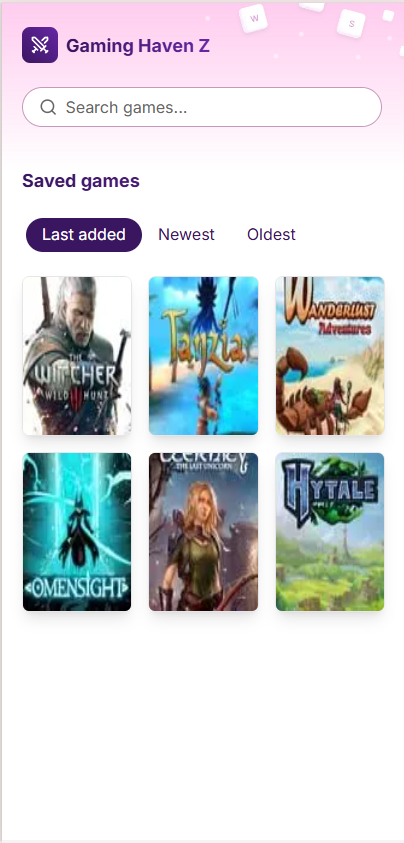
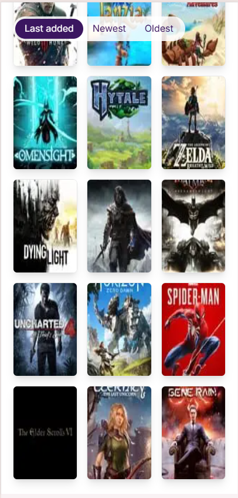
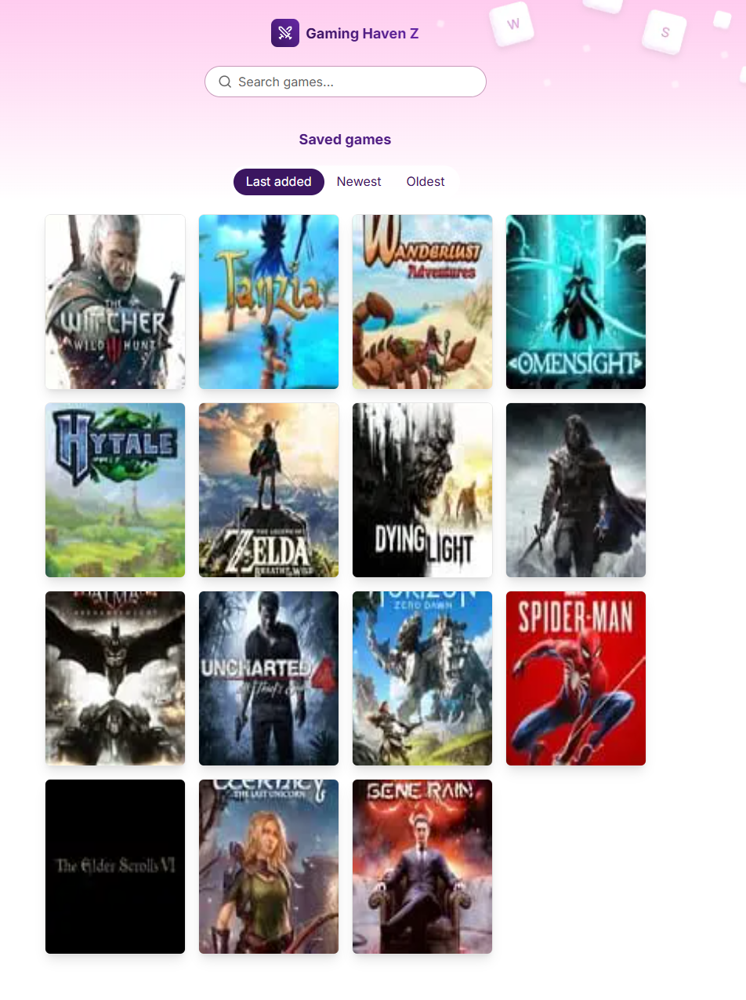
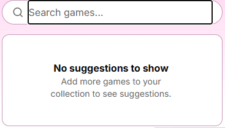
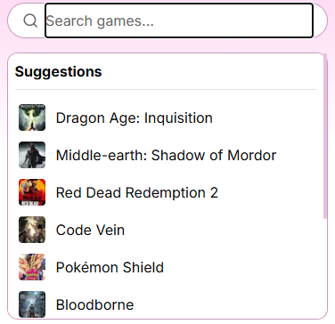
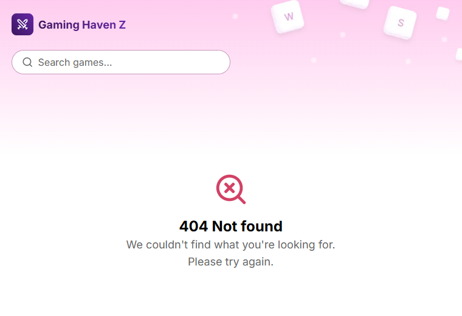
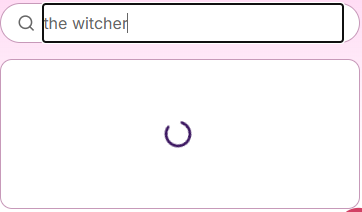
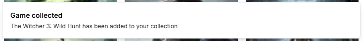
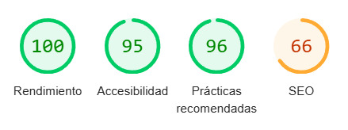

# ⚔️ Aerolab Front-end Coding challenge

This repo was created as part of the [Aerolab Front-end Coding challenge](https://github.com/Aerolab/frontend-developer-coding-challenge). Bootstrapped with Next.js 14.2.16, and [deployed on Vercel](https://aerolabs-frontend-coding-challenge-4qn7dcknw.vercel.app/).

## How to run it

If you want to test locally, simply ```clone``` the repo, ```cd``` into the directoy, and ```npm run dev``` for local development or ```npm run build``` for an optimized production build. Alternatively, you can preview the live demo [here](https://aerolabs-frontend-coding-challenge-4qn7dcknw.vercel.app/).

## Stack
* **Next.js 14.2.16**: Initially started with Next15, but ran into a few dependency issues with shadcn/ui (which are likely fixed by now).
* **IGDB API**: Query game data.
* **React Query**: For data-fetching, loading states and caching. A little bit overkill for a small project, but does the trick.
* **Shadcn & Tailwind**: Straightforward styling and ready-to-use components.
* **Framer motion** for subtle but elegant animations.
* **Lucide React** for icons.

## Features

### 🦾 Fully responsive & accessible







### 🎬 Animations


### 🌎 Custom game suggestions based on collected games





### 👆 Interaction feedback: loading, empty, error states & toast notifications







### 🔍 SSR wherever possible. SEO friendly (good Web Vitals score) and performant
> In this case SEO is a bit lower because robots.txt is set to ```x-robots-tag: noindex``` on Vercel Preview deployments.




## Caveats & things to improve
* Image quality is low, given that game covers are of type thumbnail. Can be fixed by querying for individual images, but the aim of the challenge is to solve it using only one endpoint.
* Local Storage + SSR don't work well together. Local Storage doesn't exist in the server, so the workaround is to access it only on the client side (i.e: LocalStorageProvider not only has to be a "use client" component, but also needs to have SSR manually disabled with 'next/dynamic' import).
* There's room for a few more animations.